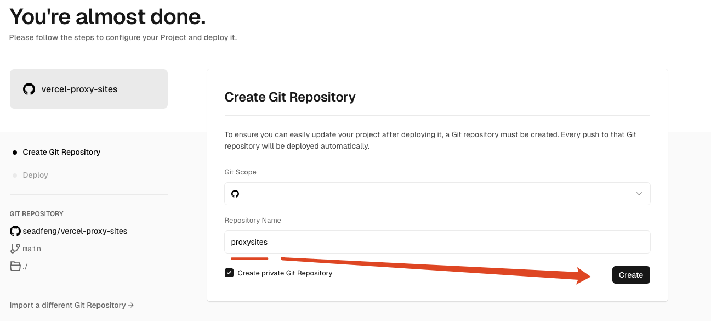
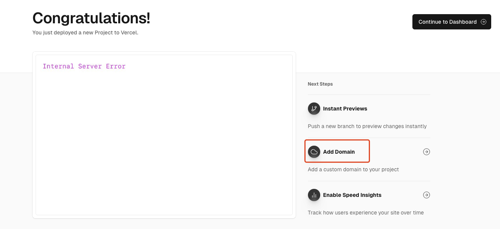
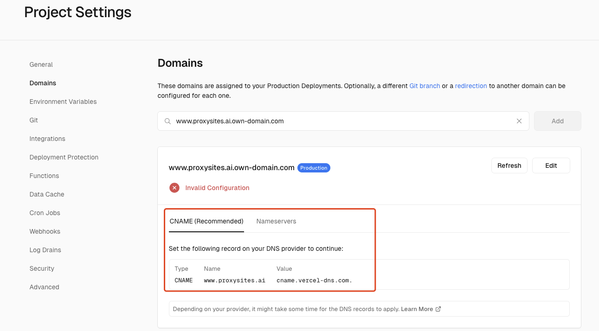
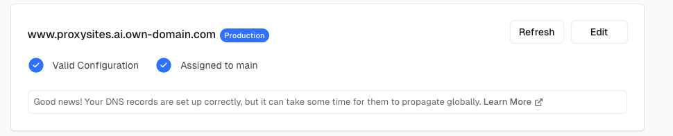
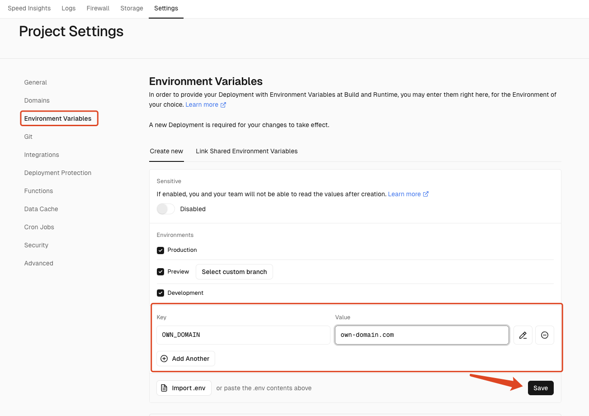
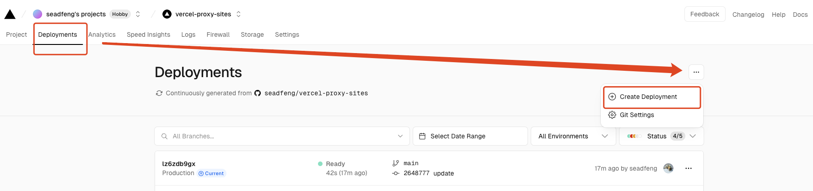
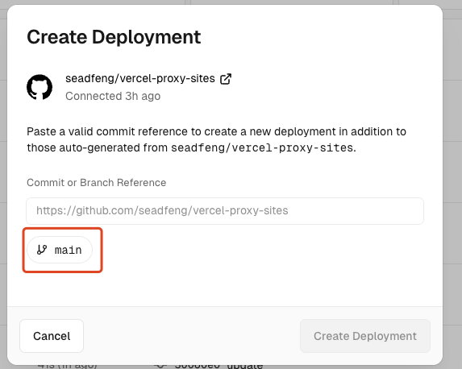
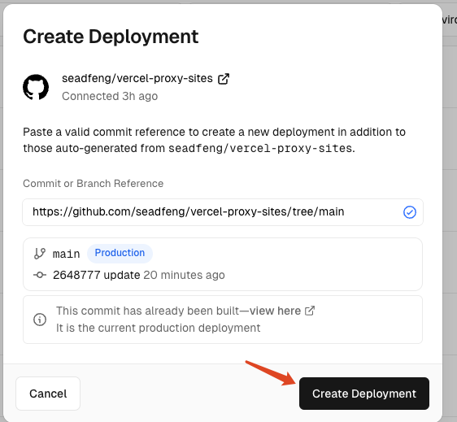

# Vercel proxy sites

## Deploy on Vercel

You can deploy this project to Vercel with the following button:

### 1. Create Git Repository 

### 2. Add Domains

### 3. valid configuration for your domains

**Valid Done!**

### 4. Environment Variables

`OWN_DOMAIN=own-domain.com`

### 5. Create Deployment

Waiting ...

Done!

### 6. Go to domains

Visit your domain:

